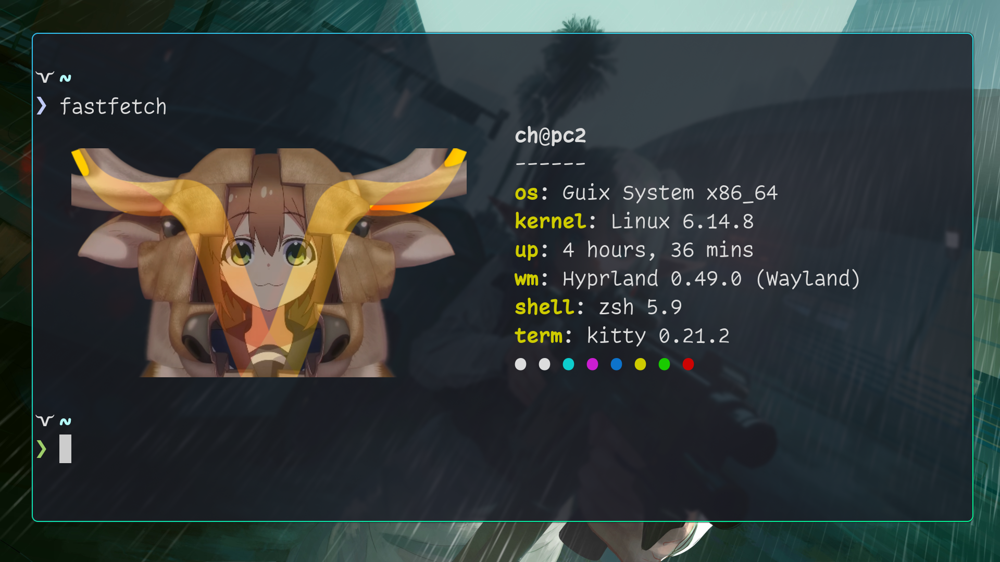

# GuixSD Configuration

This repository contains my personal GuixSD configuration.

After a quite short journey on NixOS I am starting my slow migration to Guix System.

<a href="https://gitlab.com/ch4og/guix-config">  GitLab repo </a>

<a href="https://codeberg.org/ch4og/guix-config">  Codeberg mirror </a>

> [!WARNING]
> This is extremly WIP.
